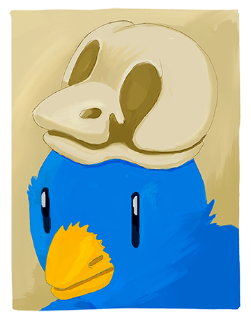

Twitter Purge
=============

A systematic way to remove your tweets because we all say dumb things.  
This script will delete all your tweets after an specific number of days that you can change.

## How to Install

You will need some version of [Ruby](http://ruby-lang.org) and to have your own server, I guess. After that:

1. Put the `twitter-purge.rb` script in your server, I use `/usr/local/sbin`.
2. Install the Twitter gem with the command `gem install twitter`.
3. Register a new Twitter application on [Twitter Application Management](https://apps.twitter.com/).
4. Update the variables at the top of the script with your stuff.
5. Make the file executable `sudo chmod +x /usr/local/sbin/twitter-purge`
6. Add a new crontab entry with the command `sudo crontab -e`.
7. If you want to check daily add `0 0 * * * /usr/local/sbin/twitter-purge`.
8. Save and exit. You are done!

## Too Many Attempts

If you have been using Twitter for a while the script will fail. The reason is simple, Twitter does not allow to delete a lot of tweets in one go. The API will throw something like `TooManyAttempts`. You just can not make a lot of requests and they block you. How many requests? Well, when I tried a while ago it was something like 150 requests.

What I did the first time was to trigger the script several times and then wait and trigger again until I had no tweets. After that the script works like a charm. I set my `DAYS_TO_KEEP` to `7` to keep a week and that number is very rarely more than 150 tweets.

## But, Marce, Why?!!

I am glad you asked. When I first started using Twitter it was something like sending SMS messages in the Internet. What mattered was the communication with people you followed and the links they shared. It was the first and only social network that I really enjoy and use everyday.

If you look closely at Twitter's movements they are going into this Twitter Cards thing. If dig a bit into it you will find it looks a lot like Facebook's posts. I think what makes Twitter great is realtime communication.

All those posts generate clicks and open the door to advertisement. Twitter could use your content in creative ways to generate revenue. I am not saying it is not fair, it is. Their platform, their rules. But I am chosing to delete my tweets to reinforce the idea of Twitter as a messaging service in the open. At least until they let me.

And anyway, have you ever read your tweets after a long time without the context of that day? It all sounds super dumb! I also delete them so I do not have to read them again. Which brings me to a deeper point: if I am not the same person from moment to moment, why all these social networks have to archive all my selves? I find that I cannot move forward if I dwell too much on my past.

## License

Do whatever you want with the script, after all the heavy lifting is done by the [Twitter gem](https://github.com/sferik/twitter) which is not my work at all. I did the little illustration in [Procreate](http://procreate.si), you can also do whatever with it. Twitter is a trademark and is copyright of their respective owners.
